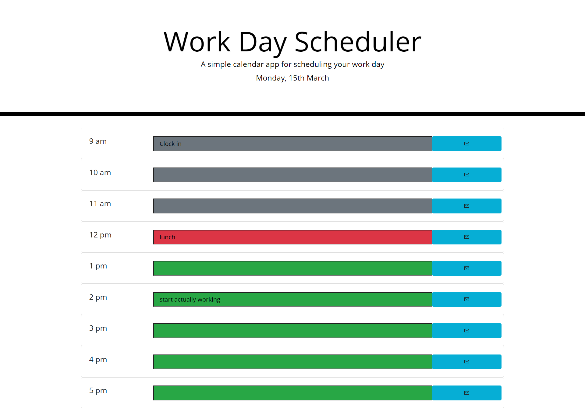

# Work-Day-Scheduler

## Description

In an attempt to incorporate third party apis such as bootstrap, JQuery, and moment.js I built an application that takes in the
current time, dynamically changes page css, and allows the user to save inputs. 

## Installation

Live site at [https://skelly1389.github.io/Work-Day-Scheduler/](https://skelly1389.github.io/Work-Day-Scheduler/)

## Usage

-Page will display time slots relative to current time as:  
<ul>
<li>Green: time is later in the day</li>
<li>Red: current time</li>
<li>Gray: time has already passed</li>
</ul>
-Clicking colored section of time slot allows user to enter events as text inputs  
-Clicking the blue save button saves text input to local storage  
-On loading page saved inputs will automatically populate correct time slots  
    
:
    
    
## Credits

Built using BootStrap, Moment.js, and JQuery

## License

Copyright 2021 Sean Kelly

Permission is hereby granted, free of charge, to any person obtaining a copy of this software and associated documentation files (the "Software"), to deal in the Software without restriction, including without limitation the rights to use, copy, modify, merge, publish, distribute, sublicense, and/or sell copies of the Software, and to permit persons to whom the Software is furnished to do so, subject to the following conditions:

The above copyright notice and this permission notice shall be included in all copies or substantial portions of the Software.

THE SOFTWARE IS PROVIDED "AS IS", WITHOUT WARRANTY OF ANY KIND, EXPRESS OR IMPLIED, INCLUDING BUT NOT LIMITED TO THE WARRANTIES OF MERCHANTABILITY, FITNESS FOR A PARTICULAR PURPOSE AND NONINFRINGEMENT. IN NO EVENT SHALL THE AUTHORS OR COPYRIGHT HOLDERS BE LIABLE FOR ANY CLAIM, DAMAGES OR OTHER LIABILITY, WHETHER IN AN ACTION OF CONTRACT, TORT OR OTHERWISE, ARISING FROM, OUT OF OR IN CONNECTION WITH THE SOFTWARE OR THE USE OR OTHER DEALINGS IN THE SOFTWARE.

## Badges

